## Capstone Project-Introduction to Cloud Computing

**Capstone Project: E-Commerce Platform Deployment with Git, Linux, and AWS**


# Project Instructions:

I'v been assigned to develope an e-commerce website for a new online marketplace named "MarketPeak." This platform will feature product listings, a shopping cart, and user authentication. To implement this project I will be using Git for version control, the develpoment platform will be in a Linux environment, and deploy it on an AWS EC2 instance. You can find a suitable website template here to kickstart your development

# Tasks

1: Implement Version Control with Git

1.1. Initialize Git Repository: Create the project directory or folder and name it "MarketPeak_Ecommerce". then cd into the new project directory and ini it as a git repository.

Below commands was used:

`mkdir MarketPeak_Ecommerce`

`cd MarketPeak_Ecommerce`

`git init`


# 1.2. Obtain and Prepare the E-Commerce Website Template:

 As a DevOps Engineer, I don't have to develope the website code, that work is for web/software developers. Instead of developing the website from scratch, I will use a pre- existing e-commerce website template.

Download a Website Template: Visit (Tooplate)[https://www.tooplate.com/] or any other free template resource, and download a suitable e-commerce website template. Look for templates that are ready to use and require minimal adjustments. It is recommended you download the specific template

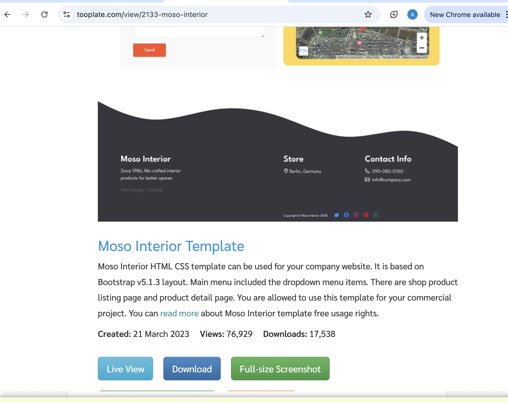


# 1.3 Stage and Commit the Template to Git

Below commands was used to carryout the staging and commiting the Template to git:

`git add .`

`git commit -m "Initial commit with basic e-commerce site structure"`

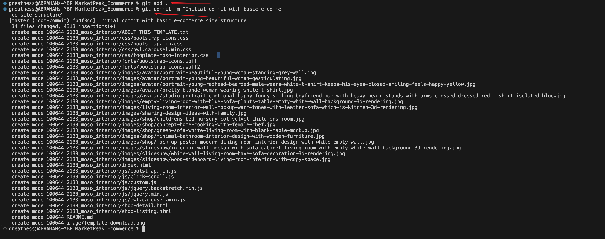

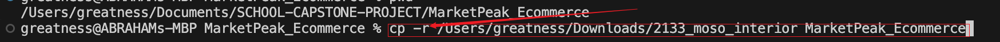


# 1.4 I Pushed the code to my Github repository

All git activities done far were done for the repository to be trace by git on our local workstation.

What happen if our system is currupted by virus or our workstation totally breakdown, that means we will lost all of our files and start all over again. That is never the best practice. To avoid this we will carry out the following steps:

4.1 Create a Remote Repository on GitHub: Log into your GitHub account and create a new repository named "MarketPeak_Ecommerce" Leave the repository empty without initializing it with a README, .gitignore, or license.

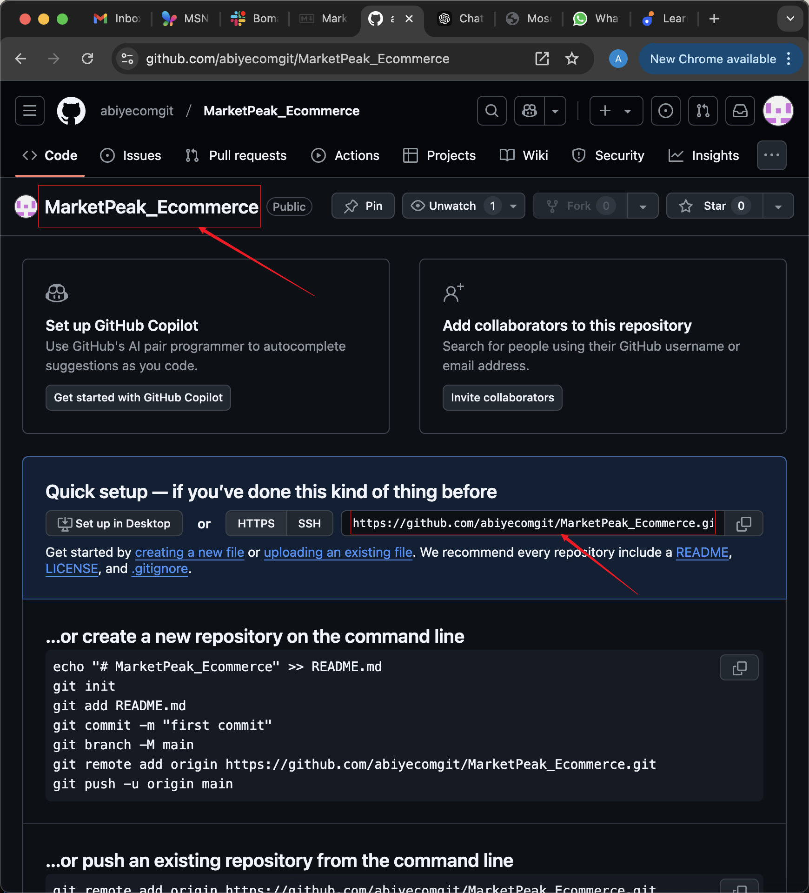

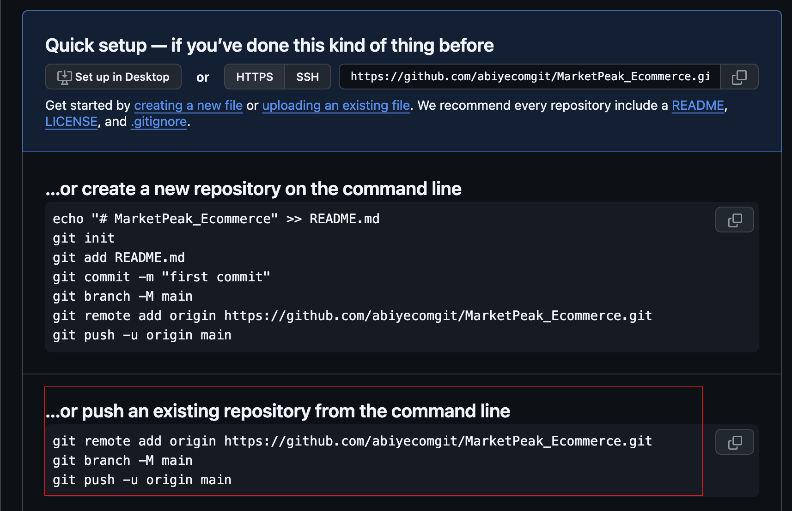


# 1.5 Link Your Local Repository to GitHub: In your terminal, within your project directory, add the remote repository URL to your local repository configuration.

 git remote add origin https://github.com/abiyecomgit/MarketPeak_Ecommerce.git

# 1.6 Push your code to GitHub repository: Push using the following command:

git push -u origin main

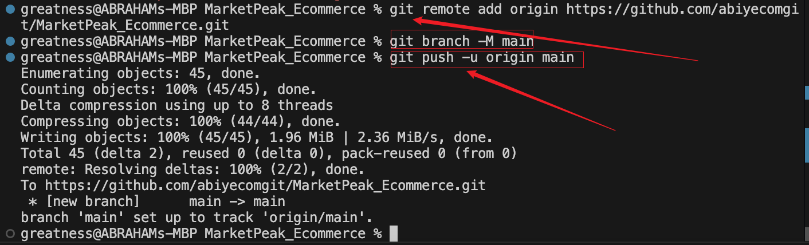


## 2: AWS Deployment

**2.1: Setup an AWS EC2 instance for deployment**

**. Log in to the AWS Management Console.**
**. Launch an EC2 instance using an Amazon Linux AMI.**
**. Connect to the instance using SSH.**
**. Note that I used my existing security group that has both port 22 and port 80 opened. I also used existing keypair**

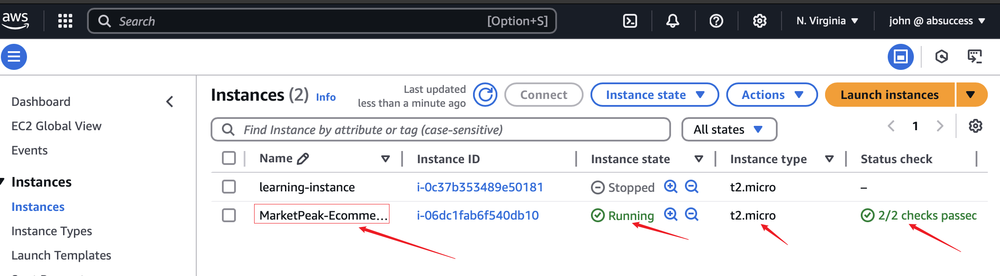


## 2.2 Clone the repository on the Linux Server

**Before deploying your e-commerce platform, you need to clone the GitHub repository to your AWS EC2 instance. This process involves authenticating with GitHub and choosing between two primary methods of cloning a repository: SSH and HTTPS. To see the ssh or http link to clone your repository: SSH and HTTPS.**

## 2.3 Authenticating with GitHub using ssh

# On your EC2 instance, generate SSH keypair using ssh-keygen as shown:

`ssh-keygen`

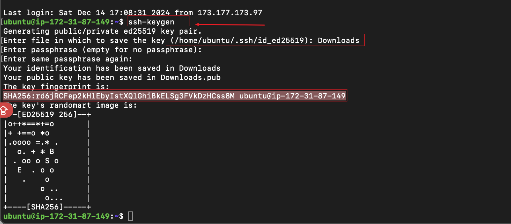


# 2.4 cat and copy the public key.

`cat /home/ubuntu/.ssh/id_ed25519.pub`


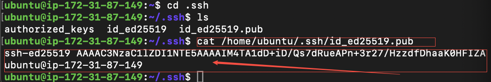


## 2.5 Adding ssh public key to GitHub repository:

**Firstly, click on your image icon, click on settings, then click on ssh and the Gkeys**

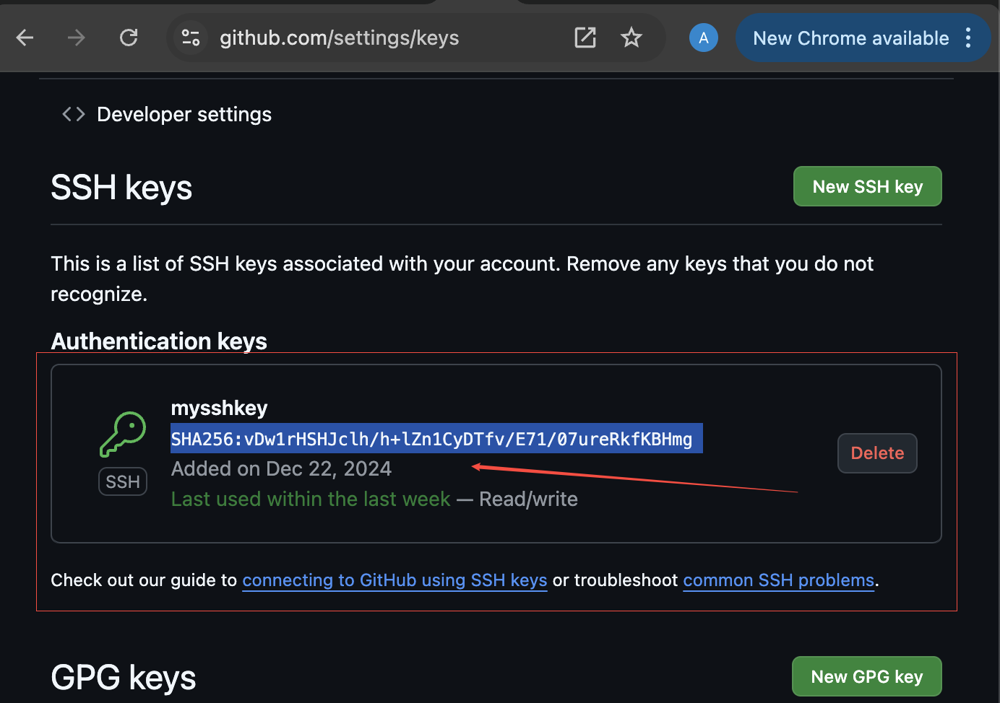


3. ## Continuous Integration and Deployment Workflow

To ensure a smooth workflow for developing, testing, and deploying your e-commerce platform, follow this structured approach. It covers making changes in a development environment, utilizing version control with Git, and deploying updates to your production server on AWS.

### Step 1: Developing New Features and Fixes

Create a Development Branch: Begin your development work by creating a separate branch. This isolates new features and bug fixes from the stable version of your website.

Below commands were used:

`git branch development`
`git checkout development`

In implementing, I changed the landing page images in image folder. 

### Step 2:

I staged the images, commit and pushed:

```markdown
git add .

git commit -m  "images edited"

git push origin development
```


### Step 3 Pull Request abd nerging to the Main branch:

When I pushed to the development branch. I pull request was automatically initiated and I created a merged requested and confirmed/merged to the main branch.


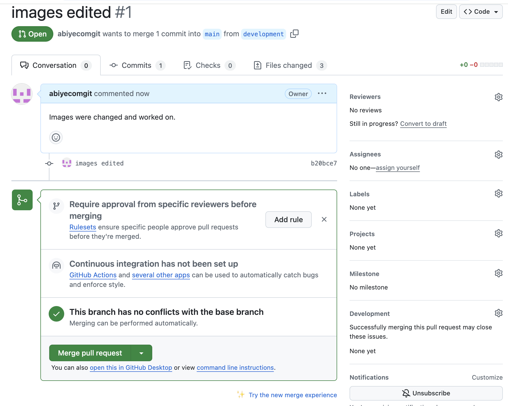